# Technical Specifications

# 1. INTRODUCTION

## 1.1 EXECUTIVE SUMMARY

TALD UNIA represents a revolutionary handheld gaming platform that leverages LiDAR technology to create an interconnected fleet ecosystem. The system addresses the growing demand for social gaming experiences by seamlessly blending real-world environments with digital gameplay. Through advanced spatial awareness and proximity-based features, TALD UNIA enables unprecedented levels of player interaction and environmental integration.

The platform serves game developers, casual players, and gaming enthusiasts by providing a comprehensive framework for creating and experiencing reality-based games. With its 5-meter range LiDAR capabilities and 0.01cm resolution scanning, TALD UNIA establishes new standards for mobile gaming interaction and social connectivity.

## 1.2 SYSTEM OVERVIEW

### Project Context

AspectDetailsMarket PositionFirst-to-market LiDAR-enabled handheld gaming platformTarget MarketSocial gamers aged 13-35 seeking innovative gaming experiencesCompetitive EdgeReal-time environmental scanning and multi-device mesh networkingEnterprise IntegrationCloud-based user profile management and game distribution networks

### High-Level Description

The system architecture centers on three core components:

1. LiDAR Processing Pipeline

- 30Hz scan rate for real-time environment capture
- GPU-accelerated point cloud processing
- Dynamic feature detection and classification

2. Fleet Ecosystem Framework

- Mesh networking for up to 32 connected devices
- Distributed processing capabilities
- Real-time environment synchronization

3. Social Gaming Platform

- Proximity-based user discovery
- Automated group formation
- Persistent world building
- Reality-based game integration

### Success Criteria

CategoryTarget MetricsPerformance- 30Hz continuous scanning- \<50ms network latency- 60 FPS UI responsivenessAdoption- 100,000 active users in first year- 1,000 registered developers- 500 published gamesEngagement- 30 minutes average daily usage- 75% user retention rate- 4.5/5 app store rating

## 1.3 SCOPE

### In-Scope Elements

CategoryComponentsCore Features- Real-time LiDAR scanning and processing- Social proximity detection- Environmental mapping- Fleet coordination- Reality-based gamingUser Groups- Casual gamers- Gaming enthusiasts- Game developersTechnical Systems- LiDAR hardware integration- React-based UI components- Point cloud processing pipeline- Mesh networking infrastructureData Domains- User profiles- Environmental scans- Game states- Social interactions

### Out-of-Scope Elements

- Virtual reality (VR) integration
- Cross-platform gameplay with non-TALD devices
- Cloud-based game streaming
- Augmented reality (AR) overlay capabilities
- Professional gaming league integration
- Third-party social network integration
- Real-money transactions
- Voice chat functionality

# 2. SYSTEM ARCHITECTURE

## 2.1 High-Level Architecture

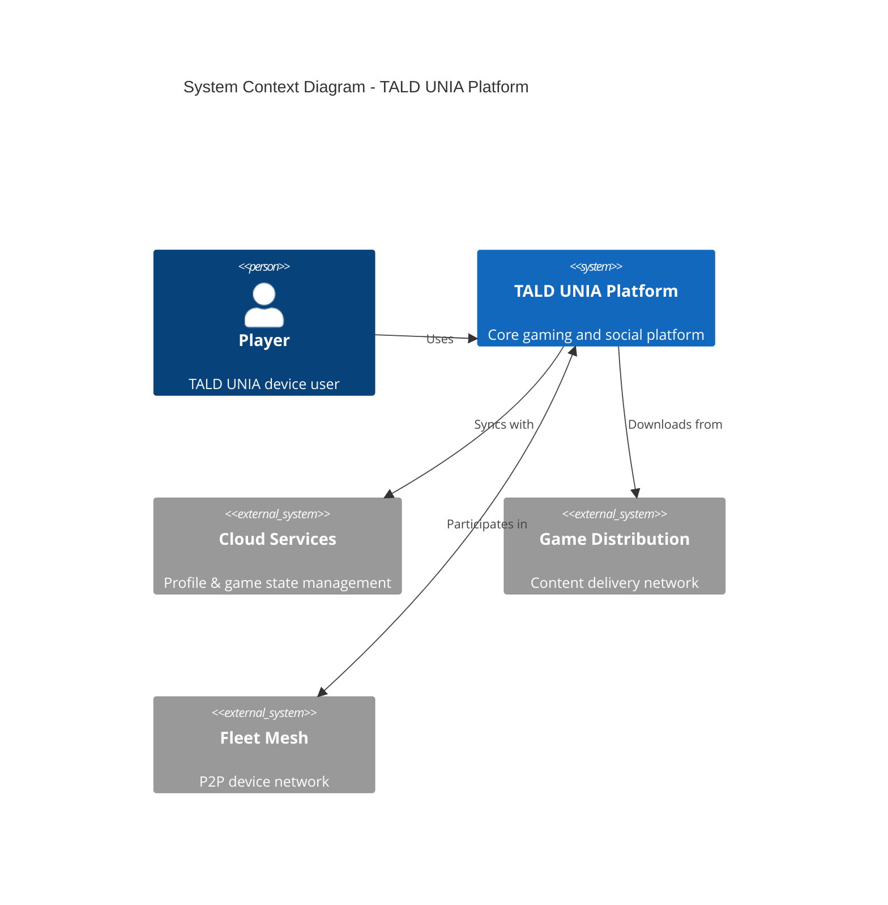
```mermaid
C4Context
    title System Context Diagram - TALD UNIA Platform

    Person(player, "Player", "TALD UNIA device user")
    System(taldSystem, "TALD UNIA Platform", "Core gaming and social platform")
    
    System_Ext(cloudServices, "Cloud Services", "Profile & game state management")
    System_Ext(gameStore, "Game Distribution", "Content delivery network")
    System_Ext(meshNetwork, "Fleet Mesh", "P2P device network")
    
    Rel(player, taldSystem, "Uses")
    Rel(taldSystem, cloudServices, "Syncs with")
    Rel(taldSystem, gameStore, "Downloads from")
    BiRel(taldSystem, meshNetwork, "Participates in")
```

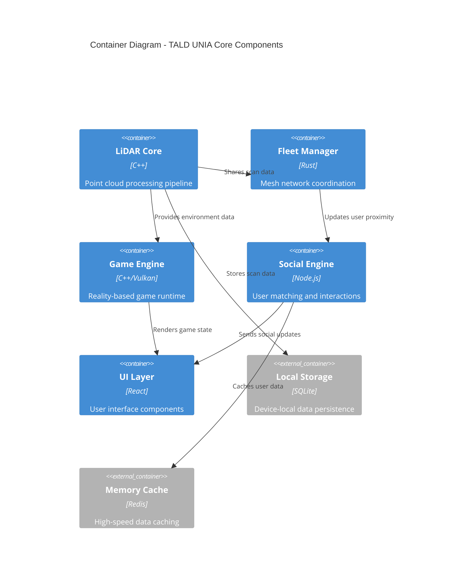
```mermaid
C4Container
    title Container Diagram - TALD UNIA Core Components

    Container(lidarCore, "LiDAR Core", "C++", "Point cloud processing pipeline")
    Container(fleetManager, "Fleet Manager", "Rust", "Mesh network coordination")
    Container(gameEngine, "Game Engine", "C++/Vulkan", "Reality-based game runtime")
    Container(socialEngine, "Social Engine", "Node.js", "User matching and interactions")
    Container(uiLayer, "UI Layer", "React", "User interface components")
    
    Container_Ext(localDB, "Local Storage", "SQLite", "Device-local data persistence")
    Container_Ext(cache, "Memory Cache", "Redis", "High-speed data caching")
    
    Rel(lidarCore, fleetManager, "Shares scan data")
    Rel(lidarCore, gameEngine, "Provides environment data")
    Rel(fleetManager, socialEngine, "Updates user proximity")
    Rel(socialEngine, uiLayer, "Sends social updates")
    Rel(gameEngine, uiLayer, "Renders game state")
    
    Rel(lidarCore, localDB, "Stores scan data")
    Rel(socialEngine, cache, "Caches user data")
```

## 2.2 Component Details

### 2.2.1 Core Components

ComponentPurposeTechnology StackScaling StrategyLiDAR CorePoint cloud processingC++, CUDA, PCLVertical (GPU)Fleet ManagerDevice coordinationRust, WebRTCHorizontal (P2P)Game EngineGame executionC++, VulkanVertical (GPU)Social EngineUser interactionsNode.js, WebSocketHorizontalUI LayerUser interfaceReact, TypeScriptN/A

### 2.2.2 Data Flow Architecture

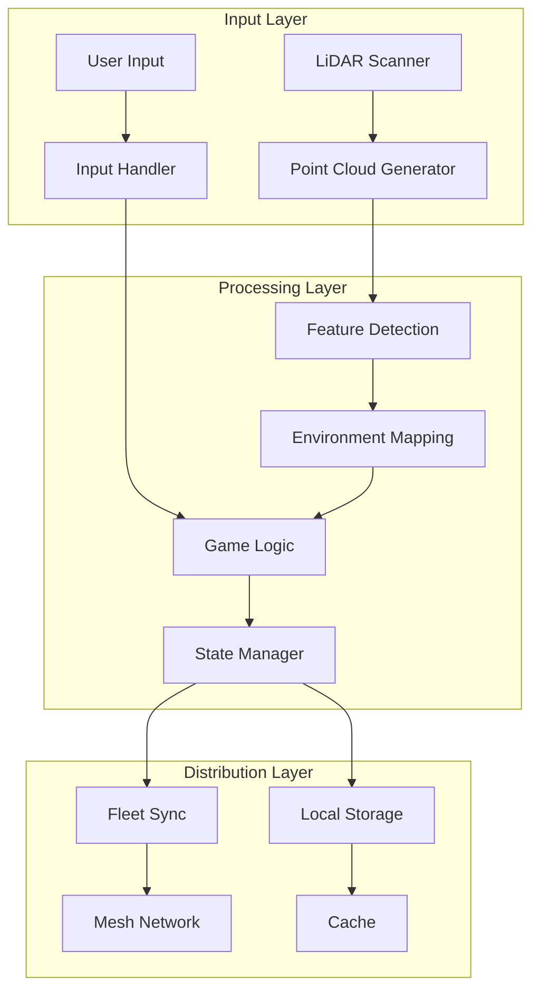
```mermaid
flowchart TD
    subgraph Input Layer
        A[LiDAR Scanner] --> B[Point Cloud Generator]
        C[User Input] --> D[Input Handler]
    end
    
    subgraph Processing Layer
        B --> E[Feature Detection]
        E --> F[Environment Mapping]
        D --> G[Game Logic]
        F --> G
        G --> H[State Manager]
    end
    
    subgraph Distribution Layer
        H --> I[Fleet Sync]
        H --> J[Local Storage]
        I --> K[Mesh Network]
        J --> L[Cache]
    end
```

## 2.3 Technical Decisions

### 2.3.1 Architecture Patterns

PatternImplementationJustificationEvent-DrivenRxJSReal-time updatesCQRSEvent SourcingState managementMicroservicesDockerComponent isolationP2P MeshWebRTCLow-latency networking

### 2.3.2 Storage Solutions

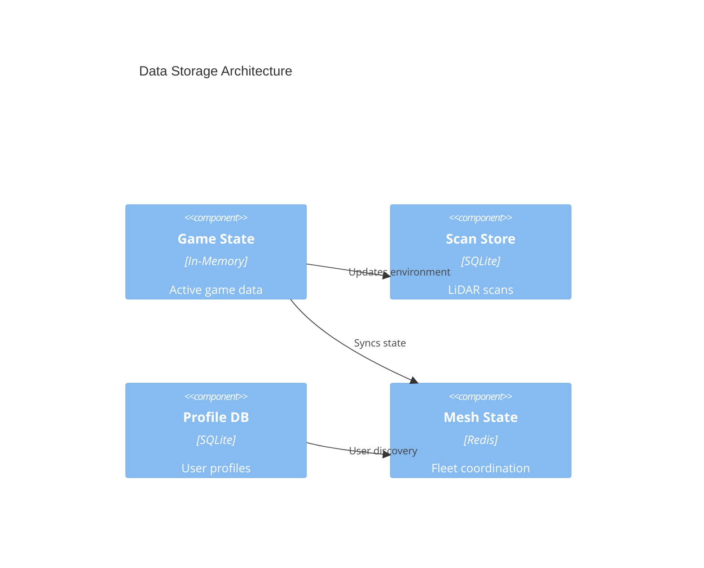
```mermaid
C4Component
    title Data Storage Architecture

    Component(gameState, "Game State", "In-Memory", "Active game data")
    Component(scanStore, "Scan Store", "SQLite", "LiDAR scans")
    Component(profileDB, "Profile DB", "SQLite", "User profiles")
    Component(meshState, "Mesh State", "Redis", "Fleet coordination")
    
    Rel(gameState, scanStore, "Updates environment")
    Rel(gameState, meshState, "Syncs state")
    Rel(profileDB, meshState, "User discovery")
```

## 2.4 Cross-Cutting Concerns

### 2.4.1 System Monitoring

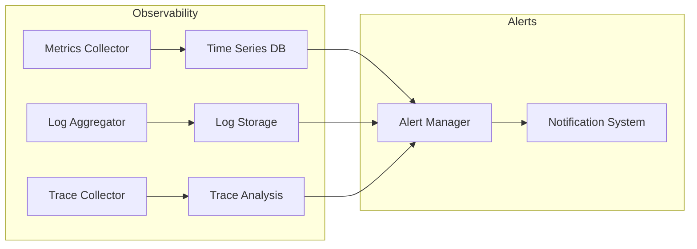
```mermaid
flowchart LR
    subgraph Observability
        A[Metrics Collector] --> B[Time Series DB]
        C[Log Aggregator] --> D[Log Storage]
        E[Trace Collector] --> F[Trace Analysis]
    end
    
    subgraph Alerts
        B --> G[Alert Manager]
        D --> G
        F --> G
        G --> H[Notification System]
    end
```

### 2.4.2 Security Architecture

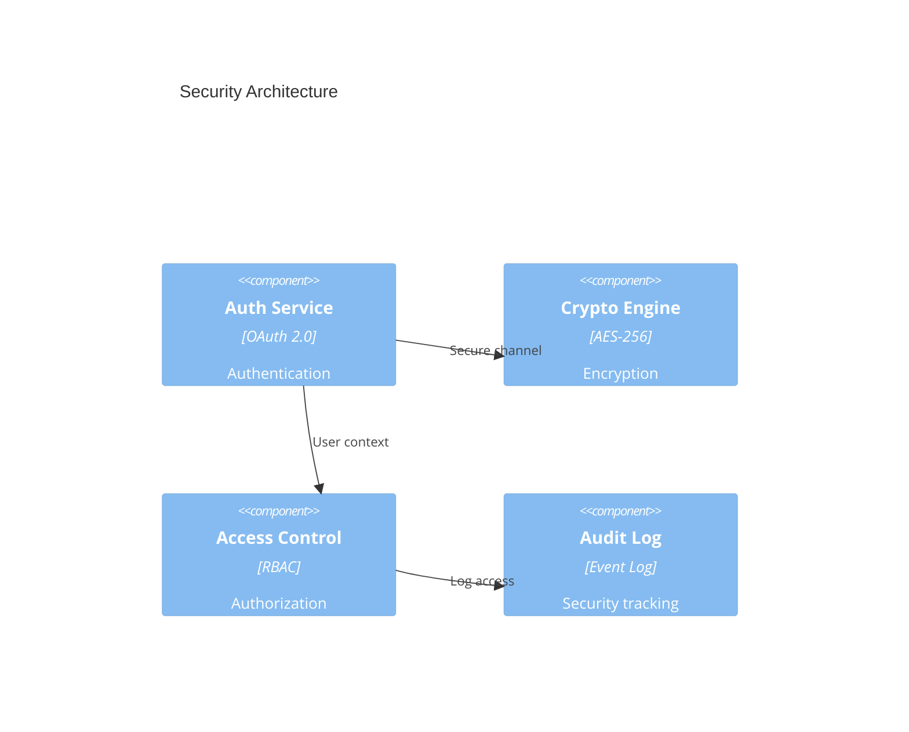
```mermaid
C4Component
    title Security Architecture

    Component(auth, "Auth Service", "OAuth 2.0", "Authentication")
    Component(crypto, "Crypto Engine", "AES-256", "Encryption")
    Component(acl, "Access Control", "RBAC", "Authorization")
    Component(audit, "Audit Log", "Event Log", "Security tracking")
    
    Rel(auth, crypto, "Secure channel")
    Rel(auth, acl, "User context")
    Rel(acl, audit, "Log access")
```

## 2.5 Deployment Architecture

```mermaid
deployment
    title TALD UNIA Deployment Architecture

    node Device {
        component LidarCore
        component GameEngine
        component FleetManager
        component LocalDB
    }
    
    node MeshNetwork {
        component P2PDiscovery
        component StateSync
    }
    
    node CloudServices {
        component ProfileSync
        component GameStore
        component Analytics
    }
    
    Device -- WebRTC --- MeshNetwork
    Device -- HTTPS --- CloudServices
```

# 3. SYSTEM COMPONENTS ARCHITECTURE

## 3.1 USER INTERFACE DESIGN

### 3.1.1 Design System Specifications

CategorySpecificationDetailsVisual HierarchyMaterial Design 3.0Elevation system for LiDAR visualizationComponent LibraryReact Material UICustom LiDAR-specific componentsResponsive DesignMobile-firstPortrait/landscape orientation supportAccessibilityWCAG 2.1 AAHigh-contrast mode for outdoor useDevice SupportTALD UNIA Hardware5.5" 120Hz OLED displayTheme SupportDynamicAuto-switching based on ambient lightLocalizationi18next12 initial languages

### 3.1.2 Core Interface Elements

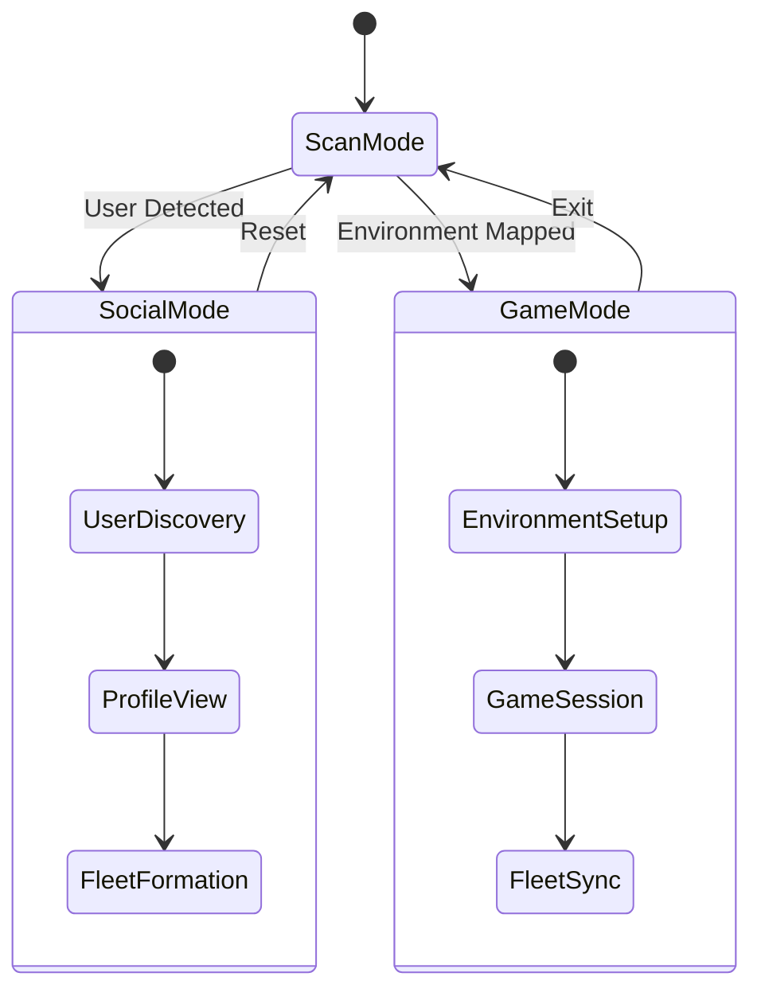
```mermaid
stateDiagram-v2
    [*] --> ScanMode
    ScanMode --> SocialMode: User Detected
    ScanMode --> GameMode: Environment Mapped
    
    state SocialMode {
        [*] --> UserDiscovery
        UserDiscovery --> ProfileView
        ProfileView --> FleetFormation
    }
    
    state GameMode {
        [*] --> EnvironmentSetup
        EnvironmentSetup --> GameSession
        GameSession --> FleetSync
    }
    
    SocialMode --> ScanMode: Reset
    GameMode --> ScanMode: Exit
```

### 3.1.3 Critical User Flows

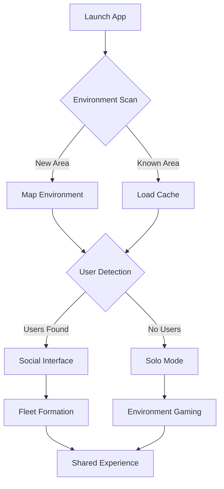
```mermaid
flowchart TD
    A[Launch App] --> B{Environment Scan}
    B -->|New Area| C[Map Environment]
    B -->|Known Area| D[Load Cache]
    
    C --> E{User Detection}
    D --> E
    
    E -->|Users Found| F[Social Interface]
    E -->|No Users| G[Solo Mode]
    
    F --> H[Fleet Formation]
    G --> I[Environment Gaming]
    
    H --> J[Shared Experience]
    I --> J
```

## 3.2 DATABASE DESIGN

### 3.2.1 Schema Design

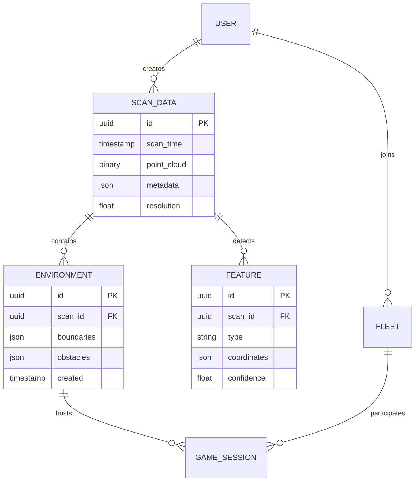
```mermaid
erDiagram
    SCAN_DATA ||--o{ ENVIRONMENT : contains
    SCAN_DATA ||--o{ FEATURE : detects
    ENVIRONMENT ||--o{ GAME_SESSION : hosts
    USER ||--o{ SCAN_DATA : creates
    USER ||--o{ FLEET : joins
    FLEET ||--o{ GAME_SESSION : participates
    
    SCAN_DATA {
        uuid id PK
        timestamp scan_time
        binary point_cloud
        json metadata
        float resolution
    }
    
    ENVIRONMENT {
        uuid id PK
        uuid scan_id FK
        json boundaries
        json obstacles
        timestamp created
    }
    
    FEATURE {
        uuid id PK
        uuid scan_id FK
        string type
        json coordinates
        float confidence
    }
```

### 3.2.2 Data Management Strategy

AspectImplementationDetailsStorage EngineSQLiteLocal device storageCache LayerRedisIn-memory point cloud cacheMigrationsFlywayVersion-controlled schema updatesBackupIncremental15-minute intervalsRetentionRolling7-day local storagePrivacyEncryptionAES-256 at rest

## 3.3 API DESIGN

### 3.3.1 Fleet API Architecture

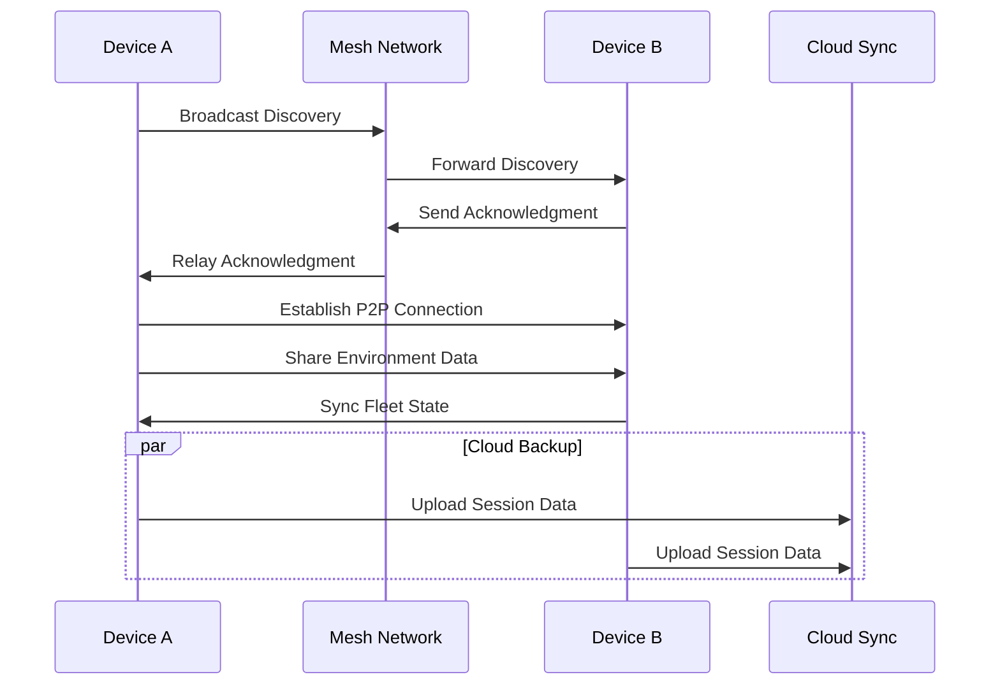
```mermaid
sequenceDiagram
    participant Device A
    participant Mesh Network
    participant Device B
    participant Cloud Sync
    
    Device A->>Mesh Network: Broadcast Discovery
    Mesh Network->>Device B: Forward Discovery
    Device B->>Mesh Network: Send Acknowledgment
    Mesh Network->>Device A: Relay Acknowledgment
    
    Device A->>Device B: Establish P2P Connection
    Device A->>Device B: Share Environment Data
    Device B->>Device A: Sync Fleet State
    
    par Cloud Backup
        Device A->>Cloud Sync: Upload Session Data
        Device B->>Cloud Sync: Upload Session Data
    end
```

### 3.3.2 API Specifications

EndpointMethodPurposeRate Limit/fleet/discoverPOSTDevice discovery10/min/fleet/connectPUTP2P connection5/min/environment/syncPOSTMap sharing30/min/session/statePATCHGame state update60/min/user/profileGETUser data fetch20/min

### 3.3.3 Integration Patterns

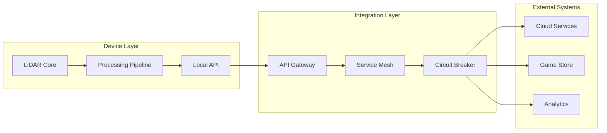
```mermaid
flowchart LR
    subgraph Device Layer
        A[LiDAR Core] --> B[Processing Pipeline]
        B --> C[Local API]
    end
    
    subgraph Integration Layer
        C --> D[API Gateway]
        D --> E[Service Mesh]
        E --> F[Circuit Breaker]
    end
    
    subgraph External Systems
        F --> G[Cloud Services]
        F --> H[Game Store]
        F --> I[Analytics]
    end
```

### 3.3.4 Security Controls

ControlImplementationPurposeAuthenticationJWTIdentity verificationAuthorizationRBACAccess controlEncryptionTLS 1.3Transport securityRate LimitingToken bucketAPI protectionValidationJSON SchemaInput sanitizationAuditingEvent loggingSecurity tracking

# 4. TECHNOLOGY STACK

## 4.1 PROGRAMMING LANGUAGES

ComponentLanguageVersionJustificationLiDAR CoreC++20Low-level hardware access, optimal performance for point cloud processingFleet ManagerRust1.70Memory safety, concurrent mesh networking, systems programmingGame EngineC++/GLSL20/460High-performance graphics, direct GPU accessSocial EngineNode.js18 LTSEfficient event handling, WebSocket supportUI LayerTypeScript/React5.0/18.2Type safety, component reusabilityDevice DriversC17Direct hardware interfacing

## 4.2 FRAMEWORKS & LIBRARIES

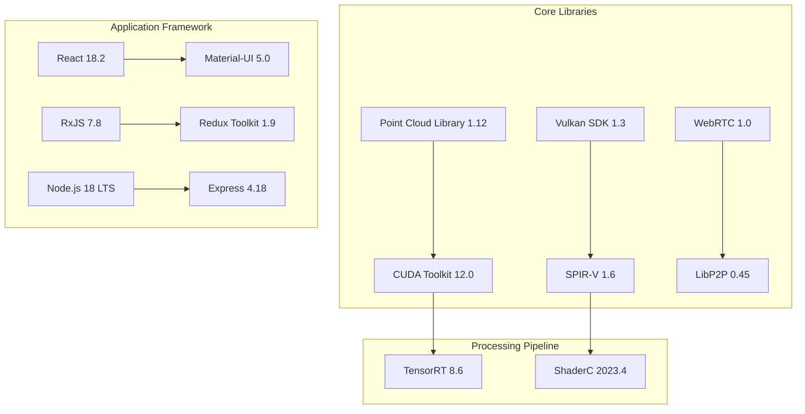
```mermaid
graph TD
    subgraph Core Libraries
        A[Point Cloud Library 1.12] --> B[CUDA Toolkit 12.0]
        C[Vulkan SDK 1.3] --> D[SPIR-V 1.6]
        E[WebRTC 1.0] --> F[LibP2P 0.45]
    end
    
    subgraph Application Framework
        G[React 18.2] --> H[Material-UI 5.0]
        I[RxJS 7.8] --> J[Redux Toolkit 1.9]
        K[Node.js 18 LTS] --> L[Express 4.18]
    end
    
    subgraph Processing Pipeline
        B --> M[TensorRT 8.6]
        D --> N[ShaderC 2023.4]
    end
```

FrameworkPurposeVersionDependenciesPoint Cloud LibraryLiDAR processing1.12CUDA 12.0, Boost 1.81VulkanGraphics rendering1.3SPIR-V 1.6ReactUI components18.2TypeScript 5.0WebRTCP2P networking1.0LibP2P 0.45RxJSEvent handling7.8TypeScript 5.0

## 4.3 DATABASES & STORAGE

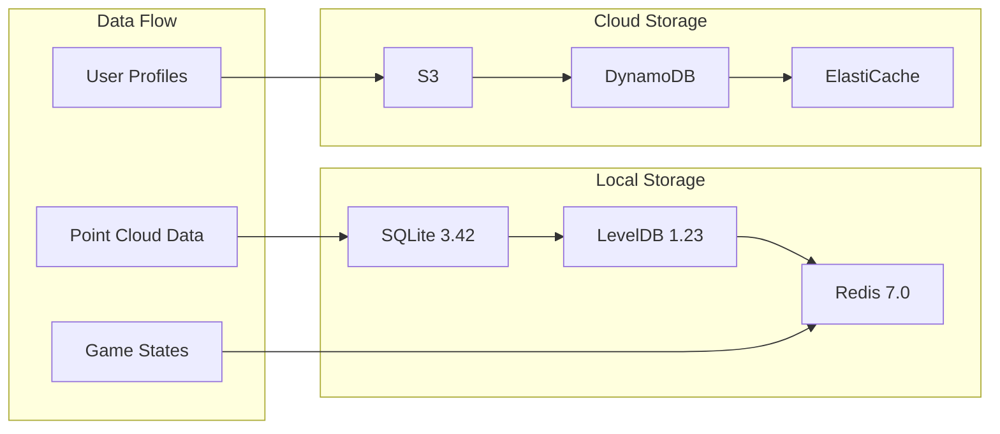
```mermaid
flowchart LR
    subgraph Local Storage
        A[SQLite 3.42] --> B[LevelDB 1.23]
        B --> C[Redis 7.0]
    end
    
    subgraph Cloud Storage
        D[S3] --> E[DynamoDB]
        E --> F[ElastiCache]
    end
    
    subgraph Data Flow
        G[Point Cloud Data] --> A
        H[User Profiles] --> D
        I[Game States] --> C
    end
```

Storage TypeTechnologyPurposeRetentionLocal DBSQLite 3.42Point cloud data, game states7 daysCacheRedis 7.0Session data, mesh network stateSessionKey-ValueLevelDB 1.23Environment features30 daysCloud StorageAWS S3User profiles, achievementsPermanentTime SeriesInfluxDB 2.7Performance metrics90 days

## 4.4 THIRD-PARTY SERVICES

ServiceProviderPurposeIntegrationAuthenticationAuth0User identityOAuth 2.0AnalyticsDatadogPerformance monitoringREST APICrash ReportingSentryError trackingSDKCloud InfrastructureAWSScalable backendSDKContent DeliveryCloudFrontGame distributionREST API

## 4.5 DEVELOPMENT & DEPLOYMENT

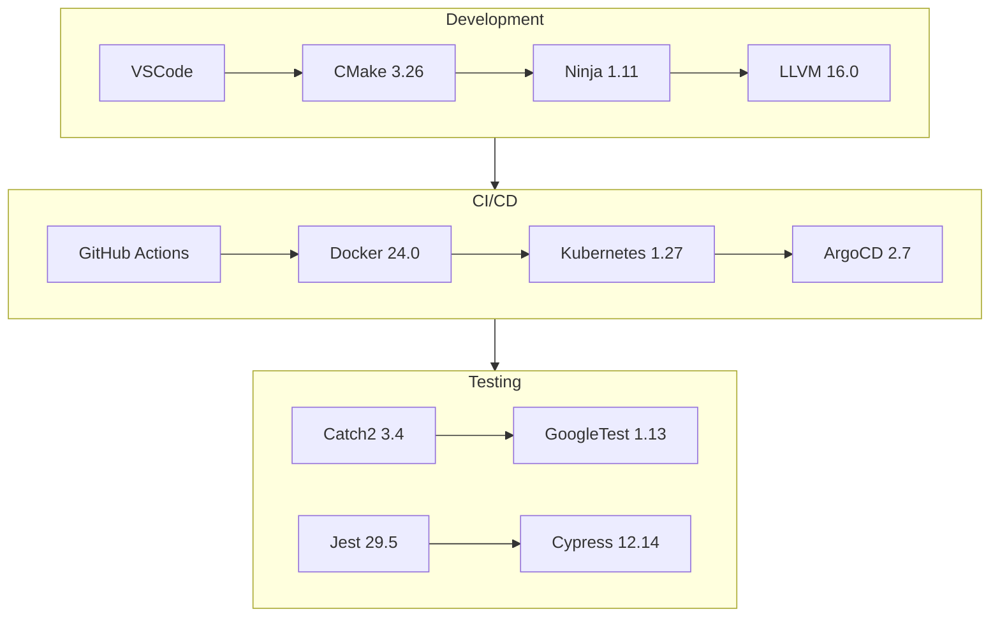
```mermaid
flowchart TD
    subgraph Development
        A[VSCode] --> B[CMake 3.26]
        B --> C[Ninja 1.11]
        C --> D[LLVM 16.0]
    end
    
    subgraph CI/CD
        E[GitHub Actions] --> F[Docker 24.0]
        F --> G[Kubernetes 1.27]
        G --> H[ArgoCD 2.7]
    end
    
    subgraph Testing
        I[Catch2 3.4] --> J[GoogleTest 1.13]
        K[Jest 29.5] --> L[Cypress 12.14]
    end
    
    Development --> CI/CD
    CI/CD --> Testing
```

CategoryToolVersionPurposeIDEVSCode1.80Development environmentBuild SystemCMake3.26Cross-platform buildsContainerizationDocker24.0Deployment packagingOrchestrationKubernetes1.27Container managementCI/CDGitHub Actions2.0Automated pipelineTestingCatch2/Jest3.4/29.5Unit/Integration testing

# 5. SYSTEM DESIGN

## 5.1 USER INTERFACE DESIGN

### 5.1.1 Core Interface Layout

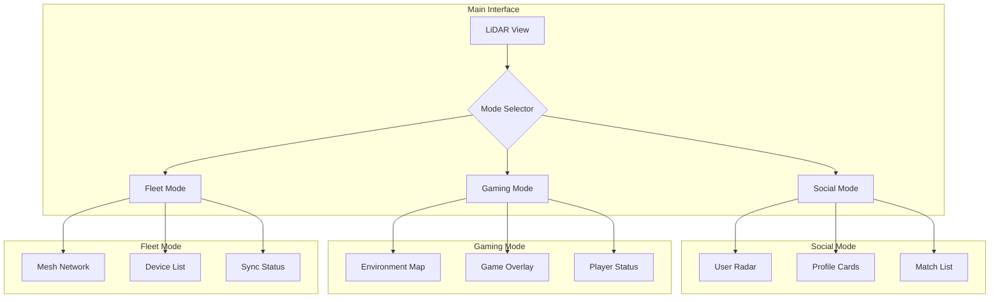
```mermaid
flowchart TD
    subgraph Main Interface
        A[LiDAR View] --> B{Mode Selector}
        B --> C[Social Mode]
        B --> D[Gaming Mode]
        B --> E[Fleet Mode]
    end
    
    subgraph Social Mode
        C --> F[User Radar]
        C --> G[Profile Cards]
        C --> H[Match List]
    end
    
    subgraph Gaming Mode
        D --> I[Environment Map]
        D --> J[Game Overlay]
        D --> K[Player Status]
    end
    
    subgraph Fleet Mode
        E --> L[Mesh Network]
        E --> M[Device List]
        E --> N[Sync Status]
    end
```

### 5.1.2 Component Specifications

ComponentDescriptionInteraction ModelLiDAR ViewReal-time point cloud visualizationPan/Zoom gesturesMode SelectorTab-based navigation interfaceTouch selectionUser RadarProximity-based user detection displayRadial touch zonesEnvironment Map3D scanned environment rendererMulti-touch manipulationMesh NetworkFleet connection visualizationNode selection

### 5.1.3 Interface States

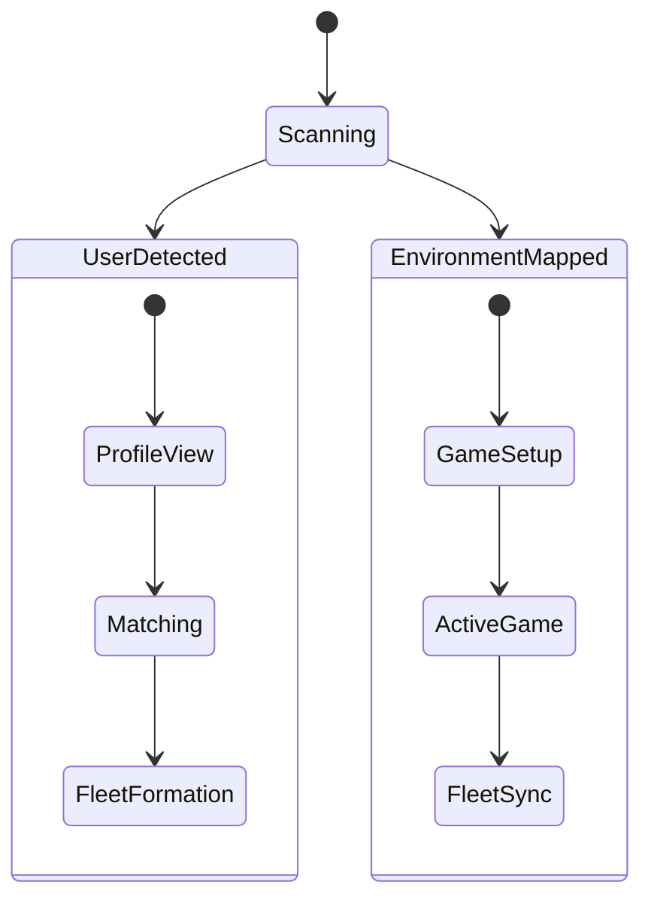
```mermaid
stateDiagram-v2
    [*] --> Scanning
    Scanning --> UserDetected
    Scanning --> EnvironmentMapped
    
    state UserDetected {
        [*] --> ProfileView
        ProfileView --> Matching
        Matching --> FleetFormation
    }
    
    state EnvironmentMapped {
        [*] --> GameSetup
        GameSetup --> ActiveGame
        ActiveGame --> FleetSync
    }
```

## 5.2 DATABASE DESIGN

### 5.2.1 Schema Design

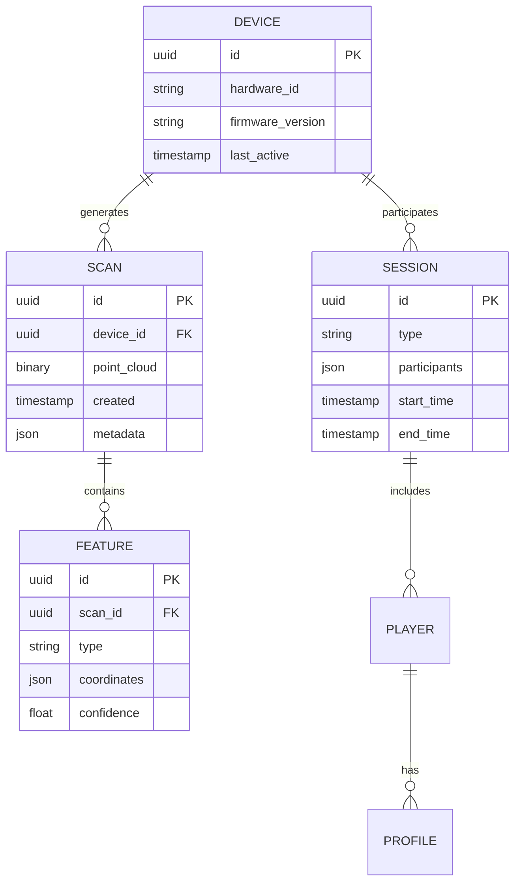
```mermaid
erDiagram
    DEVICE ||--o{ SCAN : generates
    DEVICE ||--o{ SESSION : participates
    SCAN ||--o{ FEATURE : contains
    SESSION ||--o{ PLAYER : includes
    PLAYER ||--o{ PROFILE : has
    
    DEVICE {
        uuid id PK
        string hardware_id
        string firmware_version
        timestamp last_active
    }
    
    SCAN {
        uuid id PK
        uuid device_id FK
        binary point_cloud
        timestamp created
        json metadata
    }
    
    FEATURE {
        uuid id PK
        uuid scan_id FK
        string type
        json coordinates
        float confidence
    }
    
    SESSION {
        uuid id PK
        string type
        json participants
        timestamp start_time
        timestamp end_time
    }
```

### 5.2.2 Storage Strategy

Data TypeStorage MethodRetentionBackupPoint CloudsSQLite + LevelDB7 daysDailyUser ProfilesSQLite30 daysHourlySession DataRedisActive onlyReal-timeFleet StateRedisActive onlyReal-time

## 5.3 API DESIGN

### 5.3.1 Internal APIs

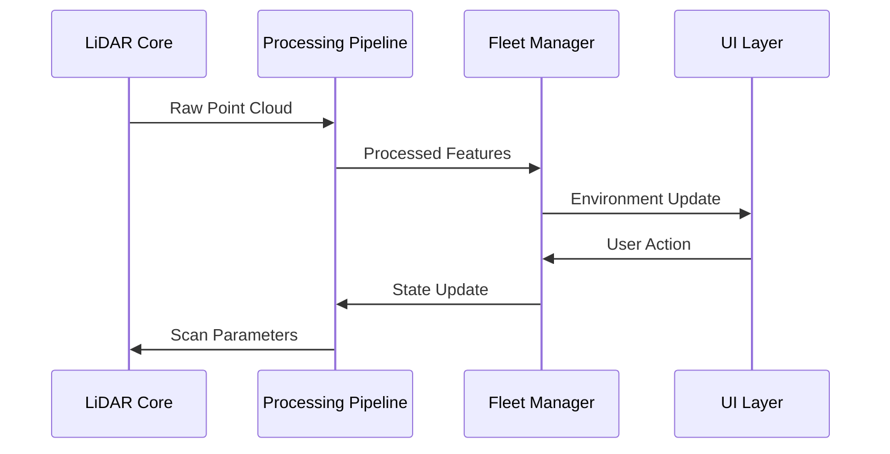
```mermaid
sequenceDiagram
    participant LiDAR Core
    participant Processing Pipeline
    participant Fleet Manager
    participant UI Layer
    
    LiDAR Core->>Processing Pipeline: Raw Point Cloud
    Processing Pipeline->>Fleet Manager: Processed Features
    Fleet Manager->>UI Layer: Environment Update
    
    UI Layer->>Fleet Manager: User Action
    Fleet Manager->>Processing Pipeline: State Update
    Processing Pipeline->>LiDAR Core: Scan Parameters
```

### 5.3.2 Fleet Communication Protocol

EndpointMethodPurposePayload/fleet/discoverPOSTDevice discoveryDevice metadata/fleet/connectPUTP2P connectionConnection params/fleet/syncPATCHState synchronizationDelta updates/fleet/environmentPOSTEnvironment sharingPoint cloud data

### 5.3.3 Data Exchange Format

```typescript
interface FleetMessage {
    type: 'DISCOVER' | 'CONNECT' | 'SYNC' | 'ENVIRONMENT';
    deviceId: string;
    timestamp: number;
    payload: {
        data: Binary | JSON;
        compression: 'none' | 'lz4' | 'zstd';
        encryption: 'aes256' | 'none';
    };
    signature: string;
}
```

### 5.3.4 Error Handling

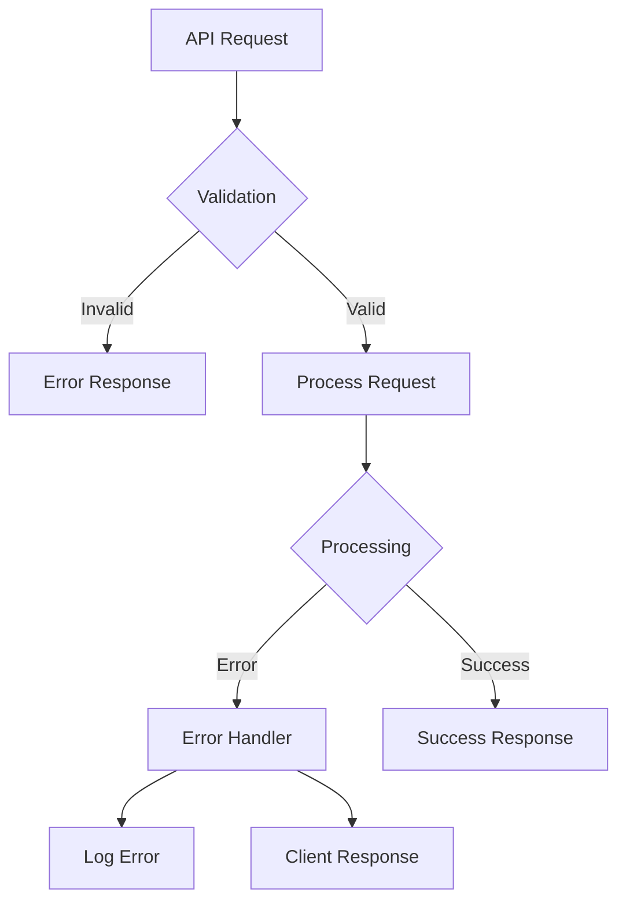
```mermaid
flowchart TD
    A[API Request] --> B{Validation}
    B -->|Invalid| C[Error Response]
    B -->|Valid| D[Process Request]
    D --> E{Processing}
    E -->|Error| F[Error Handler]
    E -->|Success| G[Success Response]
    F --> H[Log Error]
    F --> I[Client Response]
```

# 6. USER INTERFACE DESIGN

## 6.1 Interface Components Key

```
SYMBOLS:
[#] - Main menu/dashboard
[@] - User profile
[=] - Settings
[?] - Help/Info
[!] - Alerts/Warnings
[+] - Add/Create
[x] - Close/Delete
[<] [>] - Navigation
[^] - Upload
[*] - Favorite
[$] - Payment/Premium
[i] - Information

INPUTS:
[ ] - Checkbox
( ) - Radio button
[...] - Text input
[v] - Dropdown menu
[Button] - Action button
[====] - Progress bar
```

## 6.2 Main Interface Layout

```
+------------------------------------------+
|  TALD UNIA                [@] [=] [?]    |
+------------------------------------------+
|                                          |
|     +------------------------------+     |
|     |    LiDAR Viewport           |     |
|     |    [Real-time Point Cloud]  |     |
|     |                            [^]     |
|     |    [====] Scan Progress     |     |
|     +------------------------------+     |
|                                          |
|  [Social] [Gaming] [Fleet] [Environment] |
+------------------------------------------+
|  Status: Connected | Range: 4.2m | 30Hz  |
+------------------------------------------+
```

## 6.3 Social Mode Interface

```
+------------------------------------------+
|  Social Mode                 [@] [x]     |
+------------------------------------------+
|                                          |
|     +------------+    +--------------+   |
|     | [@] User1  |    |  [!] 3 Near |   |
|     | Level 12   |    |  [*] Online |   |
|     | 2.3m away  |    |             |   |
|     +------------+    +--------------+   |
|                                          |
|  +----------------------------------+    |
|  |        Proximity Radar           |    |
|  |            [@]                   |    |
|  |         [@]   [@]               |    |
|  |           [You]                 |    |
|  +----------------------------------+    |
|                                          |
|  [Match] [Message] [Add to Fleet]        |
+------------------------------------------+
```

## 6.4 Gaming Mode Interface

```
+------------------------------------------+
|  Gaming Mode                 [#] [x]     |
+------------------------------------------+
|                                          |
|     +------------------------------+     |
|     |     Environment Map         |     |
|     |     [3D Rendered Space]     |     |
|     |                            |     |
|     |     [!] Play Zone Ready    |     |
|     +------------------------------+     |
|                                          |
|  Surface Type: [v] Floor                 |
|  Game Mode: [v] Battle Arena             |
|  Players: [v] 2-8                        |
|                                          |
|  [Start Game] [Invite Fleet]             |
+------------------------------------------+
```

## 6.5 Fleet Management Interface

```
+------------------------------------------+
|  Fleet Manager               [=] [x]     |
+------------------------------------------+
|                                          |
|  Connected Devices:                      |
|  +----------------------------------+    |
|  |  [@] Device1 (Host)             |    |
|  |  +-- [@] Device2 <Active>       |    |
|  |  +-- [@] Device3 <Scanning>     |    |
|  |  +-- [@] Device4 <Joining>      |    |
|  +----------------------------------+    |
|                                          |
|  Network Status: [====] 95% Strength     |
|  Sync Status: [====] 100% Complete       |
|                                          |
|  [Create Fleet] [Join Fleet] [Leave]     |
+------------------------------------------+
```

## 6.6 Environment Scanner Interface

```
+------------------------------------------+
|  Environment Scanner         [i] [x]     |
+------------------------------------------+
|                                          |
|  Scan Parameters:                        |
|  Resolution: [v] High (0.01cm)          |
|  Range: [v] 5m                          |
|  Mode: [v] Dynamic                       |
|                                          |
|  Current Scan:                           |
|  +----------------------------------+    |
|  |     [Point Cloud Preview]        |    |
|  |     Area: 25m²                   |    |
|  |     Objects: 12                  |    |
|  |     Quality: 98%                 |    |
|  +----------------------------------+    |
|                                          |
|  [Start Scan] [Save] [Share with Fleet]  |
+------------------------------------------+
```

## 6.7 Navigation Flow

```mermaid
flowchart TD
    A[Main Interface] --> B[Social Mode]
    A --> C[Gaming Mode]
    A --> D[Fleet Manager]
    A --> E[Environment Scanner]
    
    B --> F[Profile View]
    B --> G[Matching]
    B --> H[Messages]
    
    C --> I[Game Setup]
    C --> J[Active Game]
    C --> K[Results]
    
    D --> L[Create Fleet]
    D --> M[Join Fleet]
    D --> N[Fleet Settings]
    
    E --> O[Scan Setup]
    E --> P[Processing]
    E --> Q[Save/Share]
```

## 6.8 Responsive Behavior

```
PORTRAIT MODE:
+----------------+
|    Header      |
+----------------+
|                |
|   Viewport     |
|                |
+----------------+
|   Controls     |
+----------------+
|    Status      |
+----------------+

LANDSCAPE MODE:
+------------------------+
|        Header          |
+------------------------+
|          |            |
| Viewport | Controls   |
|          |            |
+------------------------+
|        Status          |
+------------------------+
```

## 6.9 Interface States

StateVisual IndicatorUser ActionScanningPulsing blue borderCan cancel/pauseProcessingProgress spinnerWait requiredConnectedGreen status iconCan interactErrorRed alert bannerRetry availableSyncingYellow sync iconWait requiredReadyWhite steady glowCan proceed

# 7. SECURITY CONSIDERATIONS

## 7.1 AUTHENTICATION AND AUTHORIZATION

### 7.1.1 Authentication Flow

```mermaid
sequenceDiagram
    participant User
    participant Device
    participant Auth Service
    participant Fleet Network
    participant Cloud Services

    User->>Device: Launch TALD UNIA
    Device->>Auth Service: Request OAuth Token
    Auth Service-->>Device: Return JWT
    Device->>Fleet Network: Connect with JWT
    Device->>Cloud Services: Authenticate Session
    
    alt Token Expired
        Cloud Services-->>Device: Token Invalid
        Device->>Auth Service: Refresh Token
        Auth Service-->>Device: New JWT
        Device->>Cloud Services: Retry Authentication
    end
```

### 7.1.2 Authorization Matrix

RoleLocal AccessFleet AccessCloud AccessAdmin FunctionsGuestScan OnlyNoneNoneNoneBasic UserFull LocalJoin FleetRead ProfileNonePremium UserFull LocalCreate/Join FleetFull ProfileNoneDeveloperFull LocalFull FleetFull ProfileDebug ToolsAdminFull LocalFull FleetFull ProfileFull Access

## 7.2 DATA SECURITY

### 7.2.1 Encryption Standards

Data TypeAt RestIn TransitKey ManagementPoint Cloud DataAES-256-GCMTLS 1.3Device-specific KEKUser ProfilesAES-256-GCMTLS 1.3User-specific KEKFleet StateAES-256-GCMDTLS 1.3Fleet-specific KEKGame DataAES-256-GCMTLS 1.3Session-specific KEKAuthentication TokensAES-256-GCMTLS 1.3Hardware-backed KEK

### 7.2.2 Data Classification

```mermaid
flowchart TD
    subgraph Confidential
        A[User Credentials]
        B[Payment Info]
        C[Authentication Keys]
    end
    
    subgraph Restricted
        D[User Profiles]
        E[Fleet Data]
        F[Game Progress]
    end
    
    subgraph Public
        G[Environment Scans]
        H[Game Metadata]
        I[Device Status]
    end

    Confidential -->|Encrypted Storage| J[Secure Enclave]
    Restricted -->|Encrypted DB| K[Local Storage]
    Public -->|Standard Storage| L[Cache]
```

## 7.3 SECURITY PROTOCOLS

### 7.3.1 Network Security

```mermaid
flowchart LR
    subgraph Device Security
        A[TLS 1.3] --> B[Certificate Pinning]
        B --> C[JWT Validation]
        C --> D[Request Signing]
    end
    
    subgraph Fleet Security
        E[DTLS 1.3] --> F[P2P Encryption]
        F --> G[Mesh Authentication]
        G --> H[Fleet Firewall]
    end
    
    subgraph Cloud Security
        I[API Gateway] --> J[WAF]
        J --> K[DDoS Protection]
        K --> L[Rate Limiting]
    end
```

### 7.3.2 Security Controls

Control TypeImplementationUpdate FrequencyMonitoringAccess ControlOAuth 2.0 + RBACReal-timeContinuousInput ValidationJSON SchemaPer RequestPer TransactionRate LimitingToken Bucket1 minuteReal-timeAudit LoggingELK StackReal-timeDaily ReviewVulnerability ScanningSAST/DASTWeeklyPer ScanIntrusion DetectionHIDS/NIDSReal-time24/7

### 7.3.3 Incident Response

```mermaid
stateDiagram-v2
    [*] --> Monitoring
    Monitoring --> Detection: Security Event
    Detection --> Analysis: Trigger Alert
    Analysis --> Containment: Threat Confirmed
    Containment --> Eradication: Threat Isolated
    Eradication --> Recovery: Threat Removed
    Recovery --> Monitoring: System Restored
    
    Analysis --> Monitoring: False Positive
```

### 7.3.4 Security Compliance

RequirementStandardImplementationValidationData PrivacyGDPR/CCPAData EncryptionQuarterly AuditAuthenticationNIST 800-63MFA ImplementationMonthly TestingCommunicationFIPS 140-2TLS/DTLS ProtocolWeekly ScanningAccess ControlISO 27001RBAC SystemMonthly ReviewAudit LoggingSOC 2Centralized LoggingDaily MonitoringVulnerability ManagementPCI DSSRegular ScanningWeekly Reports

# 8. INFRASTRUCTURE

## 8.1 DEPLOYMENT ENVIRONMENT

```mermaid
flowchart TD
    subgraph Local Device
        A[TALD UNIA Hardware] --> B[Device OS]
        B --> C[Core Services]
        C --> D[Local Storage]
    end
    
    subgraph Edge Network
        E[Mesh Network] --> F[P2P Services]
        F --> G[Fleet Coordination]
    end
    
    subgraph Cloud Infrastructure
        H[AWS Services] --> I[Game Distribution]
        H --> J[User Profiles]
        H --> K[Analytics]
    end
    
    Local Device --> Edge Network
    Edge Network --> Cloud Infrastructure
```

EnvironmentPurposeComponentsLocal DeviceCore Gaming PlatformLiDAR Core, Game Engine, UI LayerEdge NetworkFleet EcosystemMesh Network, P2P Services, Local DiscoveryCloud InfrastructureSupporting ServicesUser Management, Content Delivery, Analytics

## 8.2 CLOUD SERVICES

### AWS Service Stack

ServicePurposeConfigurationECS FargateContainerized ServicesAuto-scaling, Spot instancesDynamoDBUser Profiles & Game StatesOn-demand capacityS3Game Content & AssetsCloudFront distributionElastiCacheSession ManagementRedis clusterAppSyncReal-time UpdatesWebSocket subscriptionsCognitoUser AuthenticationOAuth 2.0 integration

```mermaid
flowchart LR
    subgraph AWS Infrastructure
        A[API Gateway] --> B[AppSync]
        B --> C[DynamoDB]
        B --> D[ElastiCache]
        
        E[CloudFront] --> F[S3]
        G[Cognito] --> H[User Pool]
        
        I[ECS Fargate] --> J[Service Mesh]
        J --> C
        J --> D
    end
```

## 8.3 CONTAINERIZATION

### Docker Configuration

```mermaid
flowchart TD
    subgraph Container Architecture
        A[Base Image] --> B[Core Dependencies]
        B --> C[Service Layer]
        C --> D[Application Layer]
    end
    
    subgraph Services
        E[API Service]
        F[WebSocket Service]
        G[Analytics Service]
    end
    
    D --> E
    D --> F
    D --> G
```

ContainerBase ImagePurposeResourcesAPI Servicenode:18-alpineREST API endpoints1 CPU, 2GB RAMWebSocketnode:18-alpineReal-time communication2 CPU, 4GB RAMAnalyticspython:3.9-slimData processing2 CPU, 4GB RAMCacheredis:7.0-alpineIn-memory caching1 CPU, 2GB RAM

## 8.4 ORCHESTRATION

### Kubernetes Configuration

```mermaid
flowchart TD
    subgraph Kubernetes Cluster
        A[Ingress Controller] --> B[Service Mesh]
        B --> C[Pod Autoscaler]
        
        subgraph Services
            D[API Pods]
            E[WebSocket Pods]
            F[Analytics Pods]
        end
        
        C --> D
        C --> E
        C --> F
    end
```

ComponentConfigurationScaling PolicyAPI ServiceDeployment, 3 replicasCPU \> 70%WebSocketStatefulSet, 5 replicasMemory \> 80%AnalyticsDeployment, 2 replicasCustom metricsCacheStatefulSet, 3 replicasFixed scale

## 8.5 CI/CD PIPELINE

```mermaid
flowchart LR
    subgraph Development
        A[Git Push] --> B[GitHub Actions]
        B --> C[Build]
        C --> D[Test]
        D --> E[Security Scan]
    end
    
    subgraph Deployment
        E --> F[Container Registry]
        F --> G[ArgoCD]
        G --> H[Staging]
        H --> I[Production]
    end
    
    subgraph Monitoring
        I --> J[Prometheus]
        J --> K[Grafana]
        K --> L[Alerts]
    end
```

### Pipeline Stages

StageToolsPurposeSLABuildGitHub ActionsCompile and package\< 5 minTestJest, CypressUnit/Integration testing\< 10 minSecuritySonarQube, SnykCode/dependency scanning\< 5 minDeployArgoCDGitOps deployment\< 15 minMonitorPrometheus/GrafanaPerformance trackingReal-time

### Deployment Environments

EnvironmentUpdate FrequencyPromotion CriteriaDevelopmentPer commitAll tests passStagingDailyIntegration tests passProductionWeeklyFull test suite passHotfixAs neededCritical fixes only

# APPENDICES

## A.1 ADDITIONAL TECHNICAL INFORMATION

### A.1.1 LiDAR Processing Pipeline Details

```mermaid
flowchart TD
    subgraph Input Stage
        A[Raw LiDAR Data] --> B[Point Cloud Generation]
        B --> C[Noise Filtering]
    end
    
    subgraph Processing Stage
        C --> D[Feature Detection]
        D --> E[Surface Classification]
        E --> F[Object Recognition]
    end
    
    subgraph Output Stage
        F --> G[Environment Map]
        F --> H[Social Detection]
        F --> I[Game Integration]
    end
    
    subgraph Optimization
        J[GPU Acceleration] --> D
        K[Memory Management] --> E
        L[Distributed Processing] --> F
    end
```

### A.1.2 Fleet Network Architecture

ComponentImplementationPurposeScalingDevice DiscoverymDNS/WebRTCPeer detectionUp to 32 devicesMesh RoutingLibP2PNetwork topologyDynamic meshState SyncCRDTData consistencyEventually consistentLoad BalancingRound-robinProcessing distributionAutomatic failoverSecurityDTLS 1.3EncryptionPer-session keys

## A.2 GLOSSARY

TermDefinitionPoint CloudCollection of 3D data points representing scanned environmentFleet EcosystemNetwork of interconnected TALD UNIA devices sharing dataMesh NetworkDecentralized network topology where devices connect directlyCRDTConflict-free Replicated Data Type for distributed state managementSurface ClassificationProcess of identifying and categorizing scanned surfacesPlay ZoneDesignated area within scanned environment suitable for gameplaySocial Heat MapVisualization of user activity and interaction densityEnvironmental MemoryPersistent storage of previously scanned environments

## A.3 ACRONYMS

AcronymFull FormTALDTopological Augmented LiDAR DeviceUNIAUnified Network Interface ArchitectureCRDTConflict-free Replicated Data TypeDTLSDatagram Transport Layer SecuritymDNSMulticast Domain Name SystemPCLPoint Cloud LibraryGLSLOpenGL Shading LanguageSPIR-VStandard Portable Intermediate Representation - VulkanWebRTCWeb Real-Time CommunicationGPUGraphics Processing UnitLRULeast Recently UsedP2PPeer-to-Peer

## A.4 PERFORMANCE METRICS

```mermaid
graph LR
    subgraph Processing Performance
        A[LiDAR Input] -->|33ms| B[Point Cloud]
        B -->|10ms| C[Feature Detection]
        C -->|7ms| D[Environment Update]
    end
    
    subgraph Network Performance
        E[Device Discovery] -->|2s| F[Connection]
        F -->|50ms| G[State Sync]
        G -->|100ms| H[Fleet Update]
    end
    
    subgraph Memory Usage
        I[Point Cloud] -->|500MB| J[Active Memory]
        K[Environment] -->|250MB| J
        L[Fleet State] -->|50MB| J
    end
```

## A.5 ERROR HANDLING CODES

Code RangeCategoryDescriptionRecovery Action1000-1999LiDAR HardwareScanner errorsAuto-calibration2000-2999Point Cloud ProcessingData processing failuresRetry with reduced resolution3000-3999Network CommunicationConnection issuesAutomatic reconnection4000-4999Fleet CoordinationSync failuresState reconciliation5000-5999Game IntegrationRuntime errorsFallback to safe state9000-9999System CriticalFatal errorsEmergency shutdown