# Product Requirements Document (PRD)

# 1. INTRODUCTION

## 1.1 PURPOSE

This Software Requirements Specification (SRS) document provides a comprehensive technical blueprint for the TALD UNIA handheld gaming platform. It serves as the authoritative reference for:

- System architects and developers implementing core functionality
- Hardware engineers integrating LiDAR components
- QA teams validating system requirements
- Project managers tracking development milestones
- External partners developing compatible games and applications

## 1.2 SCOPE

### Product Overview

TALD UNIA is a revolutionary gaming platform that combines:

- Real-time LiDAR environmental scanning (5m range, 0.01cm resolution)
- Mesh-networked fleet coordination (up to 32 devices)
- Reality-based game engine integration
- Social proximity features
- Environmental persistence

### Core Capabilities

CategoryFeaturesEnvironmental Scanning- 30Hz continuous scanning- Feature detection and classification- Surface mapping and persistenceFleet Coordination- P2P mesh networking- Distributed processing- State synchronizationGaming Platform- Reality-based game engine- Environmental integration- Multi-player supportSocial Features- Proximity detection- Fleet formation- User profiles

### Target Users

- Primary: Social gamers (13-35 years)
- Secondary: Game developers
- Tertiary: Enterprise integration partners

### Business Objectives

- Establish market leadership in LiDAR-enabled gaming
- Build active user base of 100,000+ in first year
- Create developer ecosystem with 1,000+ registered developers
- Achieve 75% user retention rate

### Constraints

- Hardware: 5.5" 120Hz OLED display form factor
- Network: 50ms maximum latency requirement
- Processing: Real-time point cloud handling
- Power: 4-hour minimum battery life
- Storage: 7-day local data retention

# 2. PRODUCT DESCRIPTION

## 2.1 PRODUCT PERSPECTIVE

TALD UNIA operates as a standalone handheld gaming platform within a larger fleet ecosystem. The system integrates with:

- Local Environment
  - Real-time LiDAR scanning (5m range)
  - Surface mapping and classification
  - Environmental feature detection

- Fleet Network
  - Mesh-networked device coordination
  - Distributed processing capabilities
  - Synchronized game states

- Cloud Infrastructure
  - User profile management
  - Game content distribution
  - Analytics and telemetry

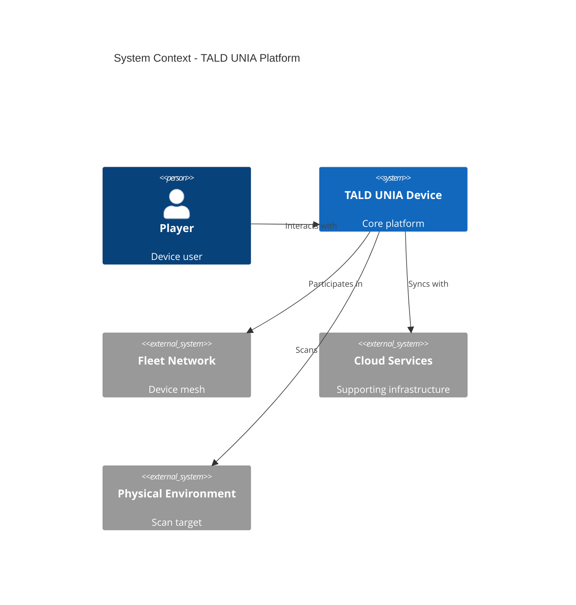

## 2.2 PRODUCT FUNCTIONS

Core capabilities include:

Function CategoryKey FeaturesEnvironmental Processing- 30Hz LiDAR scanning
- Point cloud generation
- Feature classification
- Surface mappingFleet Coordination- Device discovery (up to 32 devices)
- State synchronization
- Distributed processing
- Real-time communicationGaming Platform- Reality-based game engine
- Environmental integration
- Multi-player support
- Game state persistenceSocial Features- Proximity detection
- User discovery
- Fleet formation
- Profile management

## 2.3 USER CHARACTERISTICS

Primary user personas:

PersonaCharacteristicsNeeds/ExpectationsSocial Gamer (13-25)- Mobile gaming experience
- Social media savvy
- Limited technical knowledge- Quick session starts
- Seamless social features
- Intuitive controlsGaming Enthusiast (18-35)- Advanced gaming background
- Technical understanding
- High engagement- Deep gameplay mechanics
- Performance optimization
- Advanced settingsDeveloper (25-45)- Programming expertise
- Platform development experience
- System architecture knowledge- Comprehensive SDK
- Technical documentation
- Debug tools

## 2.4 CONSTRAINTS

### 2.4.1 Technical Constraints

- Hardware Form Factor: 5.5" 120Hz OLED display maximum size
- Battery Life: Minimum 4-hour continuous operation
- Processing: Real-time point cloud handling (30Hz)
- Network: Maximum 50ms latency for fleet operations
- Storage: 7-day local data retention limit

### 2.4.2 Regulatory Constraints

- Data Privacy: GDPR/CCPA compliance required
- RF Emissions: FCC/CE certification needed
- Eye Safety: Class 1 laser safety standards
- Export Control: Dual-use technology restrictions
- Age Rating: ESRB/PEGI certification required

## 2.5 ASSUMPTIONS AND DEPENDENCIES

### 2.5.1 Assumptions

- Users have basic smartphone experience
- Indoor/outdoor environments are scan-suitable
- Network connectivity available for cloud features
- Device storage sufficient for local caching
- Battery technology meets power requirements

### 2.5.2 Dependencies

External DependencyImpact AreaCriticalityWebRTC ImplementationFleet NetworkingHighPoint Cloud LibraryLiDAR ProcessingHighVulkan DriversGraphics RenderingMediumCloud ServicesUser ManagementMediumMobile NetworksOnline FeaturesLow

# 3. PROCESS FLOWCHART

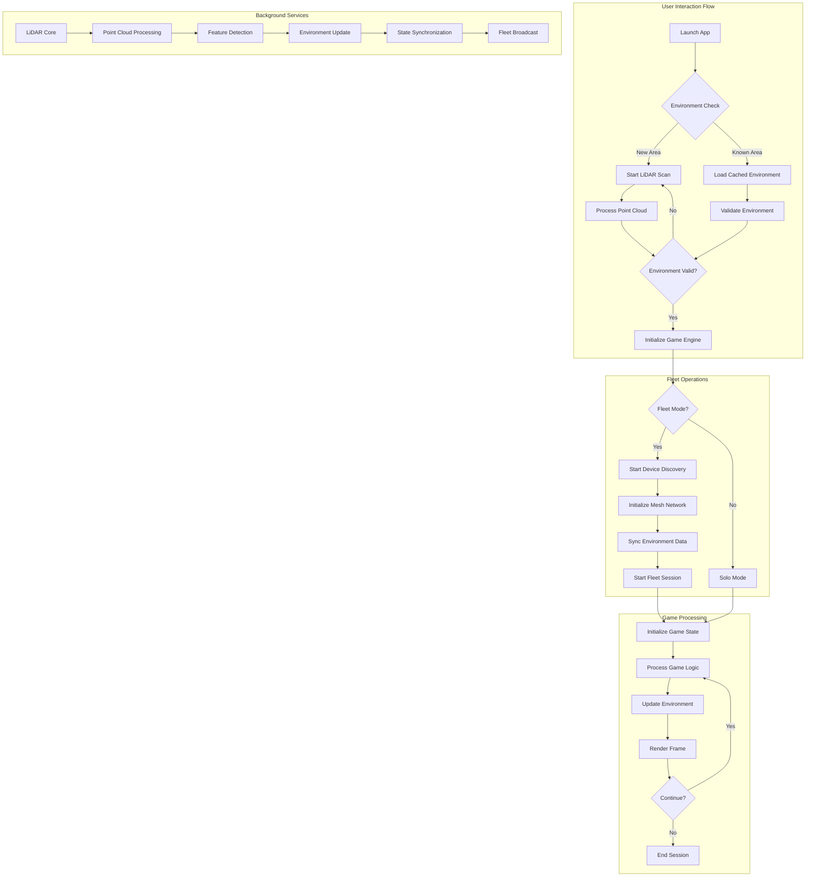

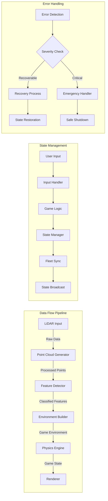

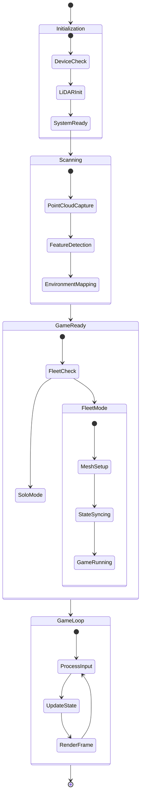

## 4. FUNCTIONAL REQUIREMENTS

### 4.1 LiDAR Scanning System

#### ID: FR-100
#### Description: Real-time environmental scanning and point cloud processing
#### Priority: Critical

| Requirement ID | Requirement Description | Acceptance Criteria |
|----------------|------------------------|-------------------|
| FR-101 | System shall scan environment at 30Hz minimum | - Verified scan rate ≥30Hz<br>- Consistent frame timing<br>- No dropped frames under normal operation |
| FR-102 | Point cloud resolution shall be 0.01cm at 5m range | - Measured accuracy within ±0.005cm<br>- Consistent resolution across range<br>- Calibration verification |
| FR-103 | System shall filter and denoise point cloud data | - SNR improvement >20dB<br>- No artifacts in processed data<br>- Real-time processing (<33ms) |
| FR-104 | System shall classify detected surfaces | - 95% accuracy for standard surfaces<br>- Surface type identification<br>- Material property detection |

### 4.2 Fleet Coordination

#### ID: FR-200
#### Description: Mesh network coordination between devices
#### Priority: High

| Requirement ID | Requirement Description | Acceptance Criteria |
|----------------|------------------------|-------------------|
| FR-201 | System shall support up to 32 connected devices | - Verified 32 device connections<br>- Stable network topology<br>- Resource scaling verification |
| FR-202 | Mesh network latency shall not exceed 50ms | - Measured P2P latency ≤50ms<br>- Jitter below 10ms<br>- Network stability metrics |
| FR-203 | System shall implement automatic fleet discovery | - Device discovery <2s<br>- Automatic topology formation<br>- Recovery from disconnections |
| FR-204 | System shall synchronize environment data | - State consistency verification<br>- Bandwidth optimization<br>- Conflict resolution |

### 4.3 Game Engine Integration

#### ID: FR-300
#### Description: Reality-based game engine functionality
#### Priority: High

| Requirement ID | Requirement Description | Acceptance Criteria |
|----------------|------------------------|-------------------|
| FR-301 | Engine shall maintain 60 FPS minimum | - Frame time ≤16.6ms<br>- No stuttering<br>- Performance profiling |
| FR-302 | System shall integrate real environment with game assets | - Seamless blending<br>- Proper occlusion<br>- Physics interaction |
| FR-303 | Engine shall support multi-player synchronization | - State synchronization<br>- Input lag <100ms<br>- Conflict resolution |
| FR-304 | System shall persist environment modifications | - Save/load verification<br>- Data integrity<br>- Storage optimization |

### 4.4 Social Features

#### ID: FR-400
#### Description: Social interaction and user discovery
#### Priority: Medium

| Requirement ID | Requirement Description | Acceptance Criteria |
|----------------|------------------------|-------------------|
| FR-401 | System shall detect nearby users | - Range accuracy ±0.5m<br>- User identification<br>- Privacy controls |
| FR-402 | System shall support fleet formation | - Group creation<br>- Role assignment<br>- Permission management |
| FR-403 | System shall manage user profiles | - Profile CRUD operations<br>- Data synchronization<br>- Privacy compliance |
| FR-404 | System shall track social interactions | - Interaction logging<br>- Metrics collection<br>- Data retention |

### 4.5 Environmental Persistence

#### ID: FR-500
#### Description: Environment mapping and storage
#### Priority: Medium

| Requirement ID | Requirement Description | Acceptance Criteria |
|----------------|------------------------|-------------------|
| FR-501 | System shall store environment maps | - Compression ratio >10:1<br>- Fast load times (<1s)<br>- Data integrity |
| FR-502 | System shall detect environment changes | - Change detection accuracy<br>- Update propagation<br>- Version control |
| FR-503 | System shall merge environment data | - Conflict resolution<br>- Consistency checking<br>- Validation process |
| FR-504 | System shall implement map versioning | - Version tracking<br>- Rollback capability<br>- Storage optimization |

# 5. NON-FUNCTIONAL REQUIREMENTS

## 5.1 PERFORMANCE REQUIREMENTS

### 5.1.1 Response Time and Latency

| Metric | Requirement | Measurement |
|--------|------------|-------------|
| LiDAR Scanning Rate | 30Hz minimum | Continuous frame timing |
| Point Cloud Processing | <33ms per frame | Processing pipeline latency |
| Fleet Network Latency | <50ms P2P | Network round-trip time |
| UI Responsiveness | <16.6ms (60 FPS) | Frame time measurement |
| Game State Updates | <100ms end-to-end | State propagation time |

### 5.1.2 Resource Utilization

| Resource | Maximum Usage | Monitoring |
|----------|--------------|------------|
| CPU | 80% sustained | Per-core utilization |
| GPU | 90% sustained | Shader utilization |
| Memory | 2GB active | Heap analysis |
| Storage | 32GB total | Disk usage tracking |
| Network | 10Mbps per device | Bandwidth monitoring |

## 5.2 SAFETY REQUIREMENTS

### 5.2.1 Hardware Safety

| Requirement | Implementation | Validation |
|-------------|----------------|------------|
| LiDAR Eye Safety | Class 1 laser compliance | IEC 60825-1 certification |
| Temperature Control | <45°C surface temperature | Thermal monitoring |
| Battery Protection | Overcharge prevention | Circuit protection |
| EMF Emissions | FCC/CE limits | RF testing |

### 5.2.2 Data Safety

| Requirement | Implementation | Recovery Time |
|-------------|----------------|---------------|
| Auto-save | Every 5 minutes | <1s restore |
| State Backup | Continuous delta sync | <5s recovery |
| Crash Recovery | State preservation | <10s restart |
| Data Integrity | CRC verification | Real-time |

## 5.3 SECURITY REQUIREMENTS

### 5.3.1 Authentication and Authorization

| Feature | Implementation | Standard |
|---------|----------------|-----------|
| User Authentication | OAuth 2.0 + JWT | NIST 800-63 |
| Device Authentication | Hardware-backed keys | FIPS 140-2 |
| Session Management | Secure token rotation | OWASP ASVS |
| Access Control | RBAC with least privilege | ISO 27001 |

### 5.3.2 Data Protection

| Protection Type | Method | Validation |
|----------------|--------|------------|
| Data at Rest | AES-256-GCM | NIST compliance |
| Data in Transit | TLS 1.3/DTLS 1.3 | PCI DSS |
| Personal Data | GDPR pseudonymization | Privacy audit |
| Secure Storage | Hardware encryption | FIPS 140-2 |

## 5.4 QUALITY REQUIREMENTS

### 5.4.1 Availability

| Metric | Target | Measurement |
|--------|--------|-------------|
| System Uptime | 99.9% | Monthly tracking |
| Service Availability | 99.95% | Daily monitoring |
| Recovery Time (RTO) | <15 minutes | Incident response |
| Recovery Point (RPO) | <5 minutes | Data loss window |

### 5.4.2 Maintainability

| Aspect | Requirement | Validation |
|--------|-------------|------------|
| Code Coverage | >90% | Automated testing |
| Documentation | Complete API docs | Technical review |
| Update Frequency | Monthly patches | Release schedule |
| Hot Fixes | <24h deployment | Emergency process |

### 5.4.3 Usability

| Feature | Requirement | Validation |
|---------|-------------|------------|
| Learning Curve | <30 minutes | User testing |
| Error Messages | Clear, actionable | UX review |
| Accessibility | WCAG 2.1 AA | Compliance audit |
| User Interface | Material Design 3.0 | Design system |

### 5.4.4 Scalability

| Aspect | Requirement | Implementation |
|--------|-------------|----------------|
| Fleet Size | 32 devices | Mesh networking |
| Concurrent Users | 100,000 | Load balanced |
| Data Storage | 7 days retention | Auto-archival |
| Processing | Linear scaling | Distributed compute |

### 5.4.5 Reliability

| Metric | Target | Measurement |
|--------|--------|-------------|
| MTBF | >1000 hours | Failure tracking |
| MTTR | <30 minutes | Repair time |
| Error Rate | <0.1% | Exception monitoring |
| Data Accuracy | 99.99% | Validation checks |

## 5.5 COMPLIANCE REQUIREMENTS

### 5.5.1 Regulatory Compliance

| Regulation | Scope | Validation |
|------------|-------|------------|
| GDPR | EU users | Privacy audit |
| CCPA | CA users | Data handling |
| COPPA | Under-13 users | Age verification |
| HIPAA | Health data | Security controls |

### 5.5.2 Technical Standards

| Standard | Implementation | Certification |
|----------|----------------|---------------|
| IEEE 802.11 | Wireless networking | Wi-Fi Alliance |
| Bluetooth 5.2 | Device pairing | SIG certification |
| USB-C | Power delivery | USB-IF compliance |
| OpenGL ES 3.2 | Graphics rendering | Conformance tests |

### 5.5.3 Industry Standards

| Standard | Area | Validation |
|----------|------|------------|
| ISO 27001 | Security | Annual audit |
| ISO 9001 | Quality | Certification |
| WCAG 2.1 | Accessibility | Compliance testing |
| PCI DSS | Payment data | Security audit |

# 6. DATA REQUIREMENTS

## 6.1 DATA MODELS

### 6.1.1 Core Data Entities

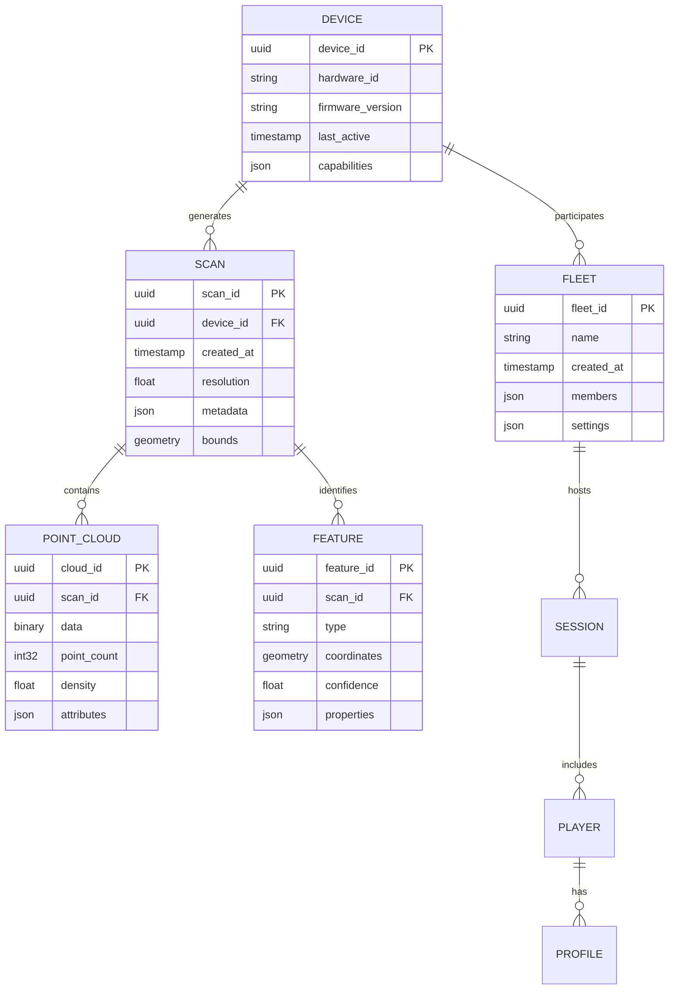

### 6.1.2 Data Relationships

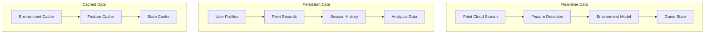

## 6.2 DATA STORAGE

### 6.2.1 Storage Requirements

| Data Type | Storage Method | Retention | Backup Frequency |
|-----------|---------------|-----------|------------------|
| Point Clouds | LevelDB | 7 days | Daily |
| User Profiles | SQLite/DynamoDB | Permanent | Hourly |
| Fleet States | Redis | Session | Real-time |
| Game Data | SQLite | 30 days | Daily |
| Analytics | InfluxDB | 90 days | Weekly |

### 6.2.2 Data Redundancy

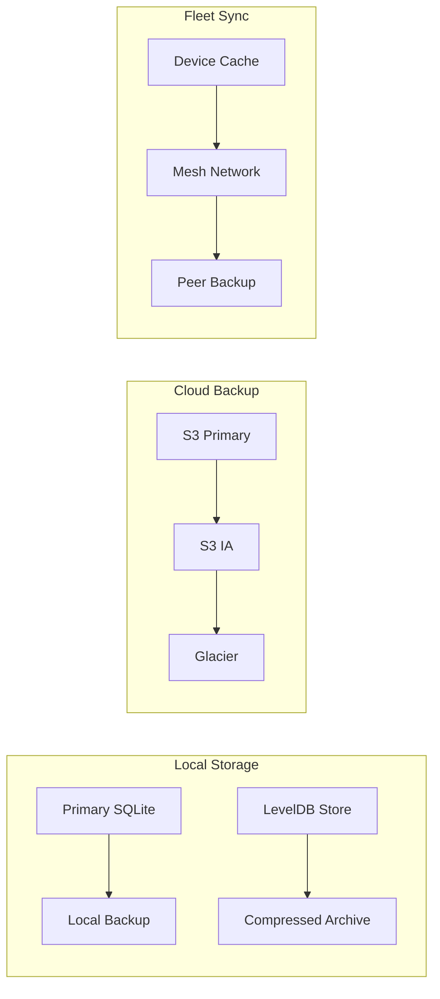

## 6.3 DATA PROCESSING

### 6.3.1 Processing Pipeline

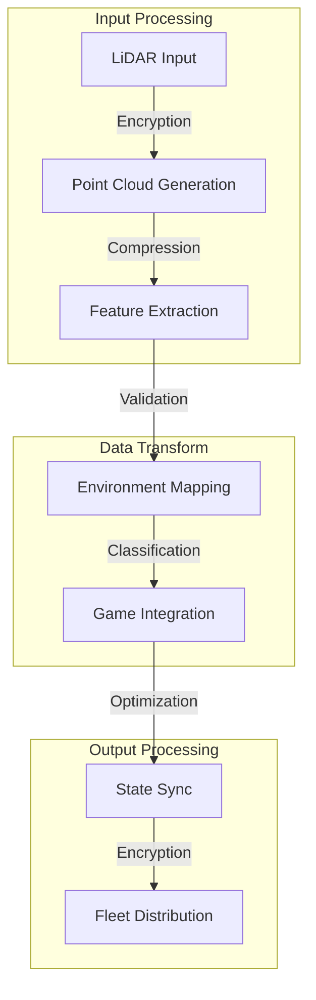

### 6.3.2 Data Security Controls

| Layer | Security Measure | Implementation |
|-------|-----------------|----------------|
| Storage | AES-256-GCM | Hardware-backed encryption |
| Transit | TLS 1.3/DTLS 1.3 | Certificate pinning |
| Processing | Memory encryption | Secure enclave |
| Access | RBAC | OAuth 2.0 + JWT |
| Audit | Event logging | ELK Stack |

### 6.3.3 Data Flow Controls

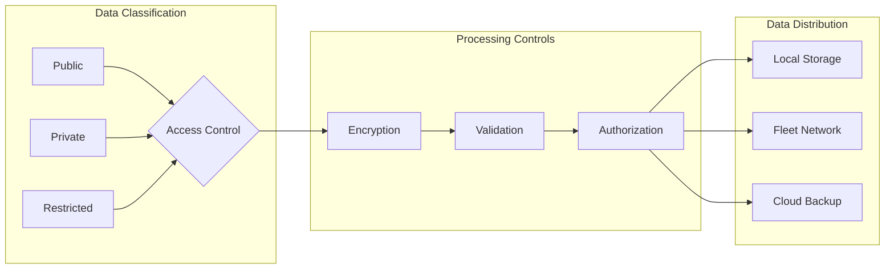

# 7. EXTERNAL INTERFACES

## 7.1 USER INTERFACES

### 7.1.1 Interface Requirements

| Component | Requirement | Implementation |
|-----------|-------------|----------------|
| Display | 5.5" 120Hz OLED | Material Design 3.0 |
| Touch Input | Multi-touch, 10-point | React Touch Events |
| Haptic Feedback | Linear actuator | Custom Haptic API |
| Status Indicators | LED notification | Material Icons |
| Orientation Support | Portrait/Landscape | React Responsive |

### 7.1.2 Interface Layout

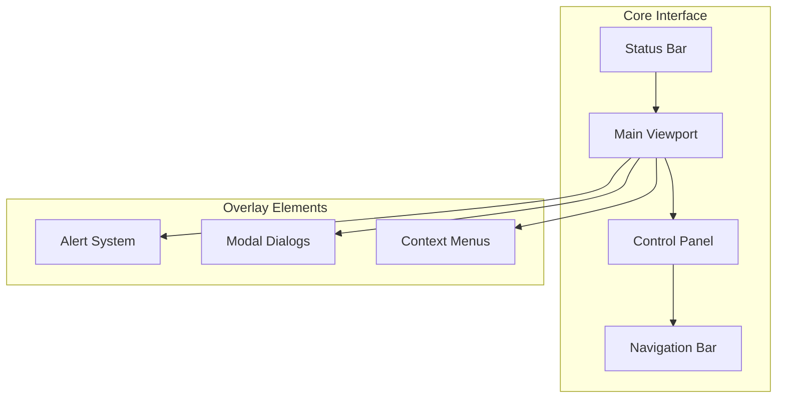

## 7.2 HARDWARE INTERFACES

### 7.2.1 LiDAR Interface

| Interface | Specification | Protocol |
|-----------|--------------|-----------|
| Data Bus | USB 3.1 Gen 2 | Custom Driver |
| Scan Rate | 30Hz minimum | Direct Memory Access |
| Resolution | 0.01cm at 5m | Binary Protocol |
| Power Management | USB-PD 3.0 | Hardware Control |

### 7.2.2 System Hardware

| Component | Interface | Driver |
|-----------|-----------|--------|
| GPU | Vulkan 1.3 | Custom Graphics Driver |
| Memory | LPDDR5 | Direct Access |
| Storage | NVMe | File System API |
| Network | Wi-Fi 6E/BT 5.2 | Network Stack |

## 7.3 SOFTWARE INTERFACES

### 7.3.1 External Services Integration

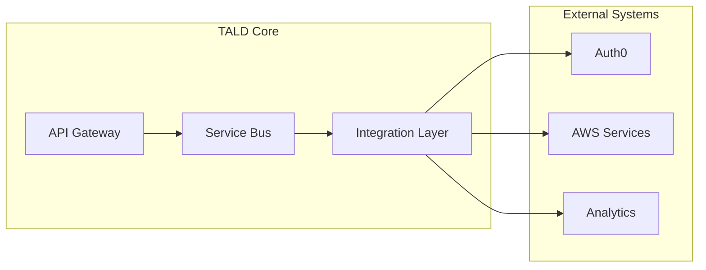

### 7.3.2 API Specifications

| Service | Protocol | Format | Authentication |
|---------|----------|--------|----------------|
| User Management | REST | JSON | OAuth 2.0 |
| Game Distribution | GraphQL | JSON | JWT |
| Analytics | gRPC | Protobuf | API Key |
| Fleet Sync | WebSocket | Binary | DTLS 1.3 |

## 7.4 COMMUNICATION INTERFACES

### 7.4.1 Network Protocols

| Protocol | Purpose | Implementation |
|----------|---------|----------------|
| WebRTC | P2P Fleet Communication | LibP2P 0.45 |
| DTLS 1.3 | Secure Transport | OpenSSL 3.0 |
| mDNS | Device Discovery | Bonjour Protocol |
| WebSocket | Real-time Updates | Socket.IO |

### 7.4.2 Data Exchange Formats

```typescript
interface NetworkMessage {
    type: MessageType;
    version: string;
    timestamp: number;
    payload: {
        format: 'binary' | 'json' | 'protobuf';
        compression: CompressionType;
        data: Uint8Array | string;
        signature: string;
    };
    metadata: {
        source: string;
        target: string;
        priority: number;
    };
}
```

### 7.4.3 Communication Security

| Layer | Security Measure | Implementation |
|-------|-----------------|----------------|
| Transport | TLS 1.3/DTLS 1.3 | OpenSSL 3.0 |
| Message | End-to-end Encryption | AES-256-GCM |
| Authentication | JWT/Certificate | Auth0 Integration |
| Authorization | RBAC | Custom ACL System |

# APPENDICES

## A.1 GLOSSARY

| Term | Definition |
|------|------------|
| Point Cloud | Three-dimensional collection of data points captured by LiDAR scanning representing physical space |
| Fleet Ecosystem | Network of interconnected TALD UNIA devices sharing environment and game state data |
| Mesh Network | Decentralized network topology enabling direct device-to-device communication |
| Surface Classification | Process of identifying and categorizing different types of scanned surfaces |
| Environmental Persistence | Capability to store and recall previously scanned environments |
| Play Zone | Validated area within scanned environment suitable for gameplay |
| Social Heat Map | Visual representation of user activity and interaction density |
| Feature Detection | Process of identifying distinct objects and surfaces within point cloud data |
| State Synchronization | Process of maintaining consistent game and environment state across fleet devices |
| Fleet Formation | Process of establishing and managing groups of connected TALD devices |

## A.2 ACRONYMS

| Acronym | Full Form |
|---------|-----------|
| TALD | Topological Augmented LiDAR Device |
| UNIA | Unified Network Interface Architecture |
| CRDT | Conflict-free Replicated Data Type |
| DTLS | Datagram Transport Layer Security |
| PCL | Point Cloud Library |
| GLSL | OpenGL Shading Language |
| SPIR-V | Standard Portable Intermediate Representation - Vulkan |
| WebRTC | Web Real-Time Communication |
| RBAC | Role-Based Access Control |
| KEK | Key Encryption Key |
| P2P | Peer-to-Peer |
| SNR | Signal-to-Noise Ratio |
| MTBF | Mean Time Between Failures |
| MTTR | Mean Time To Recovery |

## A.3 ADDITIONAL REFERENCES

| Category | Reference | Purpose |
|----------|-----------|----------|
| LiDAR Processing | PCL Documentation v1.12 | Point cloud processing implementation |
| Network Protocol | WebRTC 1.0 Specification | P2P communication standards |
| Security | NIST SP 800-63 Digital Identity Guidelines | Authentication implementation |
| Graphics | Vulkan 1.3 Programming Guide | Graphics pipeline development |
| Database | SQLite Optimization Guide | Local storage optimization |
| Mesh Networking | LibP2P Documentation | Fleet coordination implementation |
| Game Engine | SPIR-V Specification 1.6 | Shader compilation reference |
| UI Framework | Material Design 3.0 Guidelines | Interface design standards |
| Testing | Cypress 12.14 Best Practices | Integration testing methodology |
| Performance | InfluxDB Time Series Guidelines | Metrics collection and analysis |

## A.4 REVISION HISTORY

| Version | Date | Author | Changes |
|---------|------|---------|---------|
| 1.0.0 | Initial Release | System Architecture Team | Base document creation |
| 1.1.0 | Feature Update | Development Team | Added fleet coordination details |
| 1.2.0 | Security Update | Security Team | Enhanced encryption specifications |
| 1.3.0 | Performance Update | Performance Team | Updated processing requirements |
| 2.0.0 | Major Release | Integration Team | Complete system architecture revision |