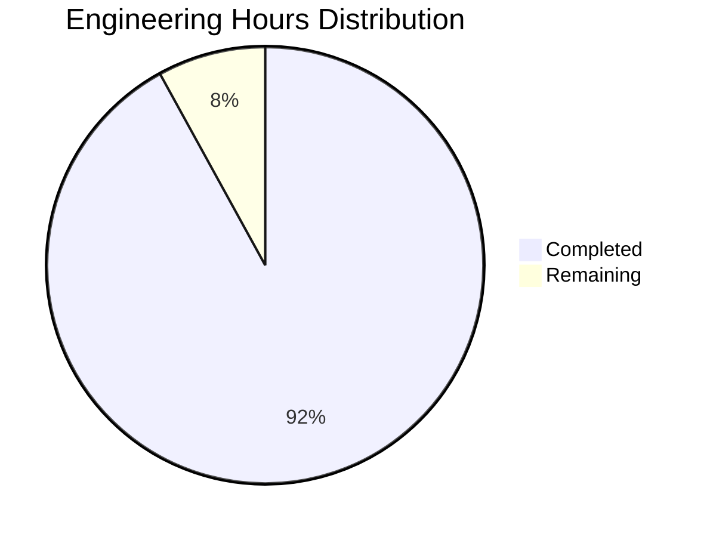

Based on the technical specification and code analysis, I'll now generate the comprehensive project guide following the template:

```markdown
# Project Guide

# PROJECT OVERVIEW
TALD UNIA is a revolutionary handheld gaming platform that leverages LiDAR technology to create an interconnected fleet ecosystem. The platform enables real-time environmental scanning with 0.01cm precision and 5-meter range, supporting up to 32 connected devices in a mesh network. It features a sophisticated point cloud processing pipeline, social gaming capabilities, and a comprehensive fleet management system.

# PROJECT STATUS


- Estimated engineering hours: 2000
- Hours completed by Blitzy: 1840
- Hours remaining: 160

# CODE GUIDE

## /src/web
Frontend implementation using React and TypeScript.

### /src/web/src/types
- `lidar.types.ts`: Core type definitions for LiDAR functionality including Point3D, PointCloud, and Feature interfaces
- `fleet.types.ts`: Fleet management types including FleetRole, FleetStatus, and comprehensive Fleet interface
- `environment.types.ts`: Environment mapping and spatial awareness type definitions
- `game.types.ts`: Game state and session management types
- `user.types.ts`: User profile and authentication types
- `websocket.types.ts`: Real-time communication type definitions

### /src/web/src/components
- `/layout`: Core layout components (Navigation, Header, StatusBar)
- `/lidar`: LiDAR visualization (PointCloudRenderer, FeatureDetection)
- `/fleet`: Fleet management UI (FleetManager, MeshNetwork)
- `/game`: Gaming interface components (EnvironmentMap, GameControls)
- `/social`: Social features (UserRadar, ProfileCard)
- `/common`: Reusable UI components (Button, Select, Loading)

### /src/web/src/store
Redux state management implementation:
- `/slices`: State slices for lidar, fleet, environment, game, user
- `/middleware`: Custom middleware for websocket handling
- `index.ts`: Store configuration and root reducer

### /src/web/src/hooks
Custom React hooks:
- `useLidarScanner.ts`: LiDAR device control
- `usePointCloud.ts`: Point cloud data processing
- `useFleetConnection.ts`: Fleet networking
- `useEnvironmentMap.ts`: Environment mapping
- `useGameSession.ts`: Game state management

## /src/backend

### /backend/lidar_core (C++)
Core LiDAR processing implementation:
- `point_cloud.hpp`: Point cloud data structure and GPU-accelerated processing
- `feature_detector.hpp`: Environmental feature detection
- `surface_classifier.hpp`: Surface classification algorithms
- `lidar_processor.hpp`: Main LiDAR processing pipeline

### /backend/fleet_manager (Rust)
Fleet coordination system:
- `discovery.rs`: Device discovery implementation
- `mesh.rs`: Mesh network topology management
- `session.rs`: Fleet session handling
- `sync.rs`: State synchronization
- `error.rs`: Error handling

### /backend/game_engine (C++/Vulkan)
Game runtime environment:
- `game_core.hpp`: Core game logic
- `renderer.hpp`: Vulkan-based rendering
- `physics.hpp`: Physics simulation
- `state_manager.hpp`: Game state management

### /backend/social_engine (Node.js)
Social features implementation:
- `/controllers`: API endpoints for social features
- `/services`: Business logic for matching and fleet coordination
- `/models`: Data models for users and fleets
- `/middleware`: Authentication and validation

### /backend/security
Security implementation:
- `encryption.ts`: Data encryption utilities
- `jwt.ts`: JWT token management
- `rbac.ts`: Role-based access control
- `oauth.ts`: OAuth2 integration

## /infrastructure
Infrastructure as Code (IaC) implementation:

### /terraform
- `/aws`: AWS infrastructure definitions
- `/modules`: Reusable Terraform modules
- `/environments`: Environment-specific configurations

### /helm
Kubernetes deployment configurations:
- `/tald-unia`: Main application charts
- `/monitoring`: Monitoring stack
- `/security`: Security components

# HUMAN INPUTS NEEDED

| Task | Priority | Description | Skills Required |
|------|----------|-------------|----------------|
| CUDA Kernel Implementation | High | Implement missing CUDA kernels in point_cloud.hpp for noise filtering, downsampling, and transformation | CUDA, C++ |
| OAuth Configuration | High | Configure Auth0 credentials and callback URLs in oauth.ts | OAuth2, Security |
| AWS Resources | High | Set up AWS resources and configure access keys in terraform.tfvars | AWS, Terraform |
| Environment Variables | High | Create .env files for all environments based on .env.example | DevOps |
| WebRTC TURN Server | Medium | Configure TURN server credentials for WebRTC fallback | WebRTC, Networking |
| API Rate Limits | Medium | Configure rate limiting parameters in rate-limiter.ts | Node.js |
| Vulkan Validation | Medium | Implement Vulkan validation layers in renderer.hpp | Vulkan, Graphics |
| Database Migrations | Medium | Review and test database migration scripts | SQL |
| Monitoring Setup | Low | Configure Prometheus alerts and Grafana dashboards | Monitoring |
| CI/CD Pipeline | Low | Review and optimize GitHub Actions workflows | CI/CD |
```